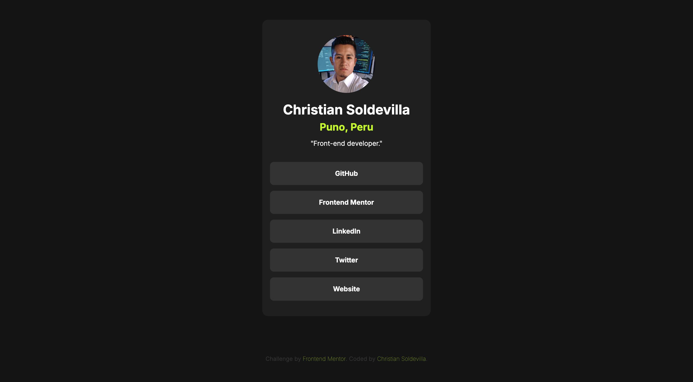

# Frontend Mentor - Social links profile solution

This is a solution to the [Social links profile challenge on Frontend Mentor](https://www.frontendmentor.io/challenges/social-links-profile-UG32l9m6dQ). Frontend Mentor challenges help you improve your coding skills by building realistic projects. 

## Table of contents

- [Overview](#overview)
  - [Screenshot](#screenshot)
- [My process](#my-process)
  - [Built with](#built-with)
  - [What I learned](#what-i-learned)
- [Author](#author)

## Overview

In this small project, you'll build out your social link-sharing profile. You can even personalize it and use it to share all your social profiles!

### Screenshot

### Links

- Solution URL: [github.com/soldochris/social-links-profile](https://github.com/soldochris/social-links-profile)
- Live Site URL: [soldochris.github.io/social-links-profile](https://soldochris.github.io/social-links-profile/)

## My process

For this project I decided to take a mobile first approach.

### Built with

- Semantic HTML5 markup
- CSS custom properties
- Flexbox
- Mobile-first workflow

### What I learned

I learned that taking a mobile-first approach is useful for reducing development time and minimizing the need to make changes to adapt styles for larger devices.

## Author

- Website - [christiansoldevilla.tech](https://christiansoldevilla.tech/?i=1)
- Frontend Mentor - [@soldochris](https://www.frontendmentor.io/profile/soldochris)
- LinkedIn - [/christian-soldevilla](https://www.linkedin.com/in/christian-soldevilla/)